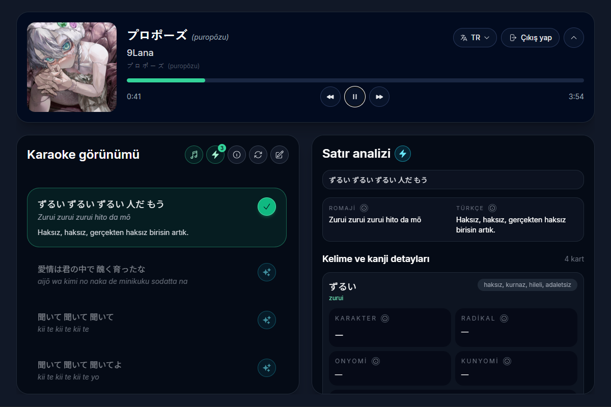
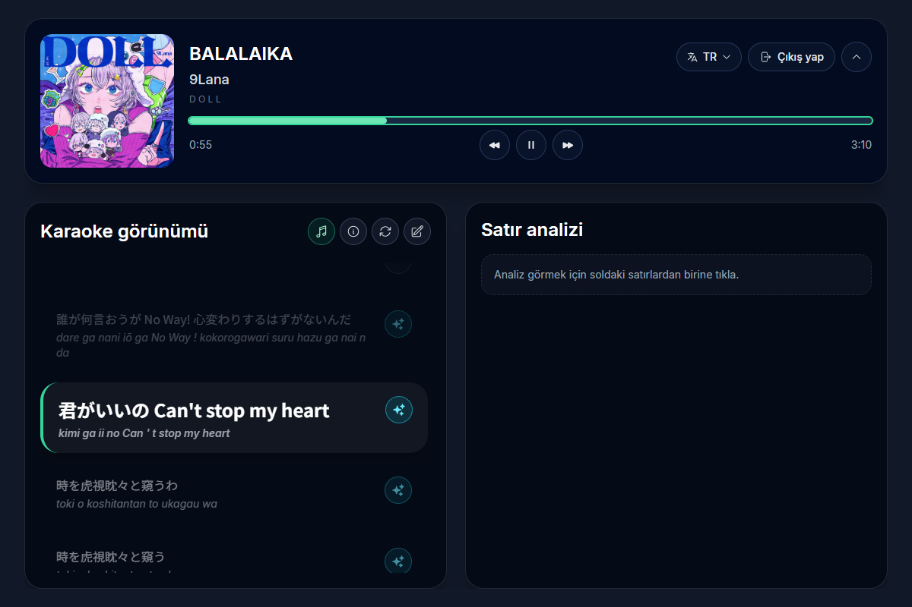
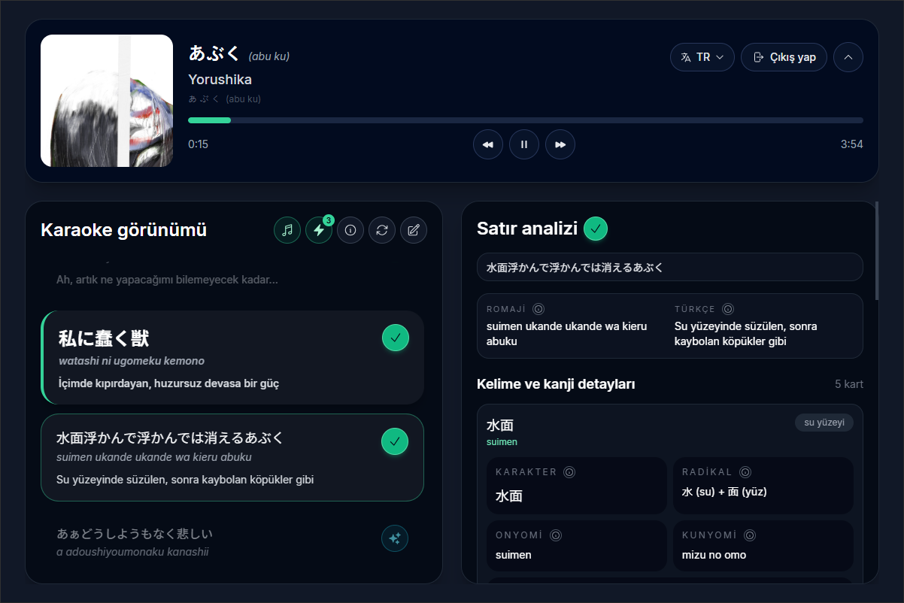
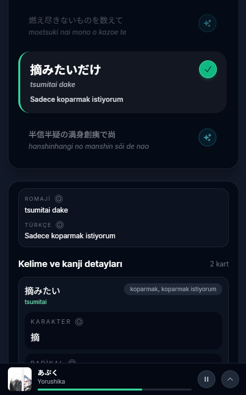

# KanaOke (カナオケ)

> 🌐 **Language / Dil:** **English** · [Türkçe](README.tr.md)

A web app that turns the Japanese songs playing on Spotify into a learning tool. It detects the current track, brings its synced lyrics on screen, shows romaji readings, and analyzes any line you click — with a natural translation, per-word meanings, and kanji details.

> **About the localization:** the app is designed around Japanese learning for Turkish speakers, so line translations and word meanings are produced in Turkish. The codebase, docs, and (over time) the UI are being moved to English as the primary language, with more UI languages planned. See [Roadmap](#roadmap).

Built with React + Vite + TypeScript, plus a small Node proxy for analysis and romaji generation.

> **Status:** personal, non-commercial **portfolio project**. It is not a product and is not monetized — it's built to demonstrate skills and to help people study Japanese. The Spotify integration runs in Development Mode, there are no paid features or ads, and song lyrics belong to their respective owners. See [License](#license) and [DISCLAIMER.md](DISCLAIMER.md).

## What it does

- 🎵 **Detects the playing track** — sign in to Spotify; the current track and its progress are tracked in real time.
- ▶️ **Controls playback** — play/pause, next/previous, and seek on the progress bar, right from the app (requires Spotify Premium).
- 📝 **Synced lyrics & karaoke** — lyrics are fetched from LRCLIB and the active line is highlighted as the song plays. If lyrics are missing or wrong, you can paste your own.
- 🔤 **Romaji readings** — Latin-script readings are shown automatically for the track info and Japanese lyric lines.
- 🧠 **Line analysis** — click a line to get a natural, context-aware translation, the meaning of each word, and kanji details (on'yomi, kun'yomi, radical, description).
- ⚡ **Fast repeats** — fetched lyrics and analyses are cached in the browser, so the same line opens instantly next time.

## Screenshots

Desktop — synced karaoke lyrics on the left, line analysis with translation, per-word meanings, and kanji details on the right:



| Karaoke view | Line analysis (kanji details) |
|---|---|
|  |  |

Mobile — the player stays pinned to the bottom:



## Setup

You'll need: Node.js, a Spotify account (Premium for playback controls), and a personal access token (PAT) with access to GitHub Models.

1. **Create a Spotify app.** Open an app at https://developer.spotify.com/dashboard and add `http://127.0.0.1:5173/callback` as a Redirect URI.

2. **Prepare your `.env` file.** Copy `.env.example` in the root to `.env` and fill in the values — the most important are the Spotify Client ID and `GITHUB_MODELS_TOKEN`. See [docs/CONFIGURATION.md](docs/CONFIGURATION.md) for every variable.

3. **Install and run.**
   ```bash
   npm install
   npm run proxy   # in a separate terminal — analysis + romaji server
   npm run dev     # Vite dev server
   ```

4. **Open in the browser.** Go to the address Vite prints and sign in with Spotify.

## How to use

1. Sign in with Spotify, then play a Japanese song on Spotify (on your computer or phone).
2. The current track and its synced lyrics appear on screen; the active line is highlighted like karaoke.
3. Click a line you want to understand — the right panel opens with the translation, words, and kanji details.
4. If no lyrics are found (or they're wrong), paste your own into the "manual lyrics" field.

> Tip: On desktop, the top "now playing" panel can be minimized to give the lyrics more room; on mobile the player is pinned to the bottom of the screen.

## Development

```bash
npm run proxy     # analysis + romaji proxy
npm run dev       # dev server
npm run lint      # ESLint
npm run build     # production build
npm run preview   # preview the build
```

## Roadmap

- 🌍 **Multi-language UI** — extract hardcoded UI strings into a localization layer so the interface can ship in multiple languages.
- 🔘 **In-app language switcher** — let users change the UI language at runtime.
- 🇯🇵 More target languages for translations (e.g. Japanese, English) beyond the current Turkish.

## More

- **Configuration, environment variables, Codespaces, and proxy details:** [docs/CONFIGURATION.md](docs/CONFIGURATION.md)

## Tech stack

React 19 · Vite · TypeScript · Tailwind CSS · Spotify Web API (OAuth 2.0 PKCE) · LRCLIB · GitHub Models · kuroshiro + kuromoji (romaji)

## License

**Proprietary — all rights reserved.** This is **not** open-source software. The
source is published publicly only for demonstration and portfolio review; no
permission is granted to reuse, modify, redistribute, or run it as a service
without prior written consent. See [LICENSE](LICENSE).

This applies to the project's own code. Third-party libraries keep their own
licenses, and song lyrics belong to their respective rights holders — they are
not owned or licensed by this project.

## Legal & attribution

KanaOke is an independent, non-commercial project and is **not affiliated with or
endorsed by** Spotify, GitHub, LRCLIB, or any artist or music publisher. All
trademarks belong to their owners. Lyrics are the property of their respective
rights holders; the app shows them for personal study and does not store or
redistribute them server-side. For the full statement — Spotify usage, lyrics
copyright, scope, and takedown contact — see [DISCLAIMER.md](DISCLAIMER.md).
